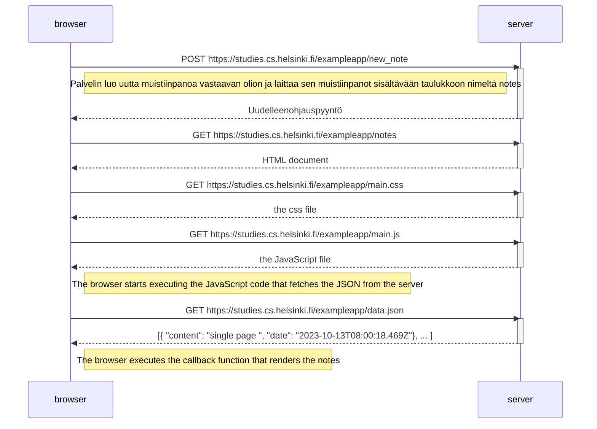

```mermaid
sequenceDiagram
    participant browser
    participant server

    browser->>server: POST https://studies.cs.helsinki.fi/exampleapp/new_note
    activate server
    note left of server: Palvelin luo uutta muistiinpanoa vastaavan olion ja laittaa sen muistiinpanot sisältävään taulukkoon nimeltä notes
    server-->>browser: Uudelleenohjauspyyntö 
    deactivate server
    
    
    browser->>server: GET https://studies.cs.helsinki.fi/exampleapp/notes
    activate server
    server-->>browser: HTML document
    deactivate server
    
    browser->>server: GET https://studies.cs.helsinki.fi/exampleapp/main.css
    activate server
    server-->>browser: the css file
    deactivate server
    
    browser->>server: GET https://studies.cs.helsinki.fi/exampleapp/main.js
    activate server
    server-->>browser: the JavaScript file
    deactivate server
    
    Note right of browser: The browser starts executing the JavaScript code that fetches the JSON from the server
    
    browser->>server: GET https://studies.cs.helsinki.fi/exampleapp/data.json
    activate server
    server-->>browser: [{ "content": "single page ", "date": "2023-10-13T08:00:18.469Z"}, ... ]
    deactivate server    

    Note right of browser: The browser executes the callback function that renders the notes 
```
